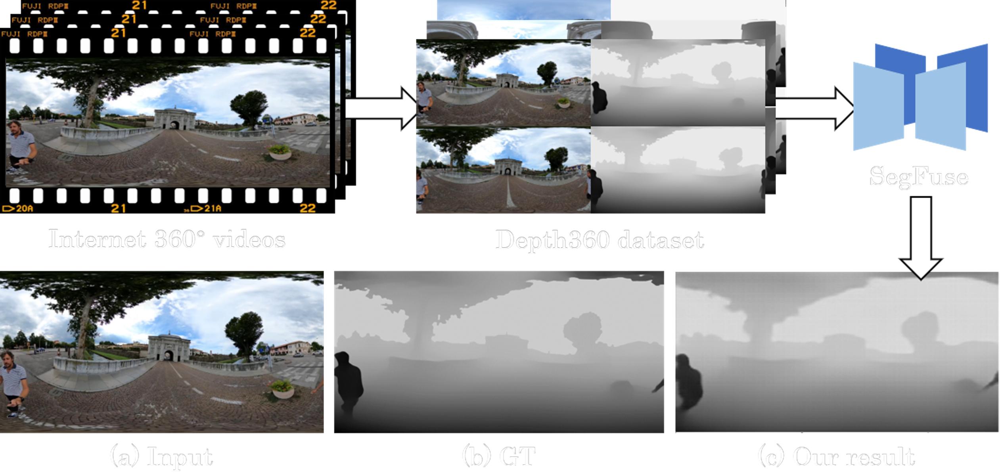

# 360 Depth Estimation in the Wild - The Depth360 Dataset and the SegFuse Network

<p align='left'>

</p>

In IEEE Conference on Virtual Reality and 3D User Interfaces (IEEE VR), 2022

For more details:
[Project page](https://segfuse.github.io/)
[Arxiv(to be updated)]()

## Getting Started
#### Requirements
- Python (tested on 3.7.4)
- PyTorch (tested on 1.6.0)
- Other dependencies
```
pip install -r requirements.txt
```

## Usage
First clone our repo:
```
git clone https://github.com/HAL-lucination/segfuse.git
cd segfuse
```

### Dataset
For review purpose, download our Depth360 dataset at [here.](https://drive.google.com/file/d/1460RBiV_YwuYSxqOeBh7qfuYu2HCvw8D/view?usp=sharing)

### Pretrained Model
Download the [pretrained model](https://drive.google.com/file/d/1lFHCyS0zoaP3HzRKYU6DEVYfwdJ7mRi9/view?usp=sharing) and put in the **save** folder:
```
mkdir save
```

## License
This work is licensed under MIT License. See [LICENSE](LICENSE) for details. 


```
@InProceedings{
}
```

