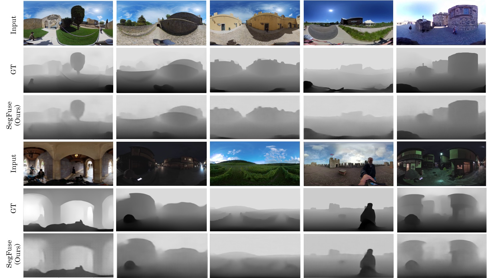

# 360 Depth Estimation in the Wild - <br />The Depth360 Dataset and the SegFuse Network
In IEEE Conference on Virtual Reality and 3D User Interfaces (IEEE VR), 2022

For more details:
[Project page](https://segfuse.github.io/) / [Arxiv(to be updated)]()

## Overview
<p align='center'>

</p>

*We present a method for generating large amounts of color/depth training data from abundant internet 360 videos. After creating a large-scale general omnidirectional dataset, Depth360, we propose an end-to-end two-branch multitasking network, SegFuse to learn single-view depth estimation from it. Our method shows dense, consistent and detailed predictions.*

## Results
<p align='center'>

</p>

*Qualitative results of the proposed method. Our method generates globally consistent estimation and sharper results at local regions. Detailed comparisons with state-of-the-art can be found in the paper.*

## Getting Started
#### Requirements
- Python (tested on 3.7.4)
- PyTorch (tested on 1.6.0)
- Other dependencies
```
pip install -r requirements.txt
```

## Usage
First clone our repo:
```
git clone https://github.com/HAL-lucination/segfuse.git
cd segfuse
```

## Depth360 Dataser (v1)
The Depth360 dataset includes 30000 pairs of color and depth images generated with the test-time training method described in the paper.
[Depth360 dataset link](https://docs.google.com/forms/d/e/1FAIpQLSdh7n-3RE0TnR1T09QFmu-VGQYfH4a2Efh8Od2ISveUJqNqPw/viewform?usp=sf_link)


## Pretrained Model
Download the [pretrained model](https://drive.google.com/file/d/1lFHCyS0zoaP3HzRKYU6DEVYfwdJ7mRi9/view?usp=sharing) and put in the **save** folder:
```
mkdir save
```

## License
This work is licensed under MIT License. See [LICENSE](LICENSE) for details. 

## Citations
```
@InProceedings{
}
```
This will be updated after the conference.

## Acknowledgements
We appreciate the anonymous reviewers for their valuable feedback. This research was supported by JST-Mirai Program (JPMJMI19B2), JSPS KAKENHI (19H01129, 19H04137, 21H0504) and the Royal Society (IES\ R2\ 181024).

